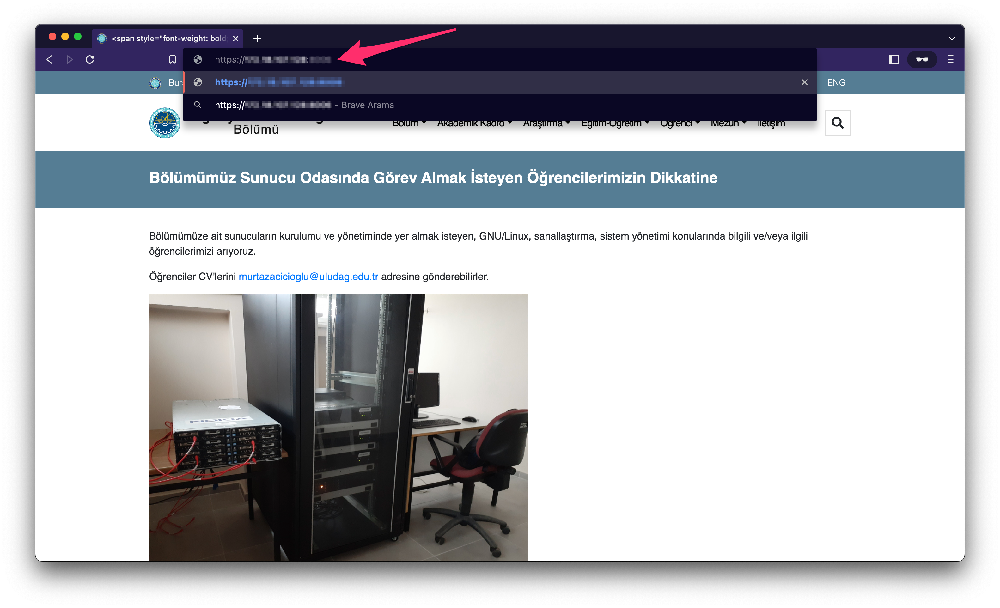
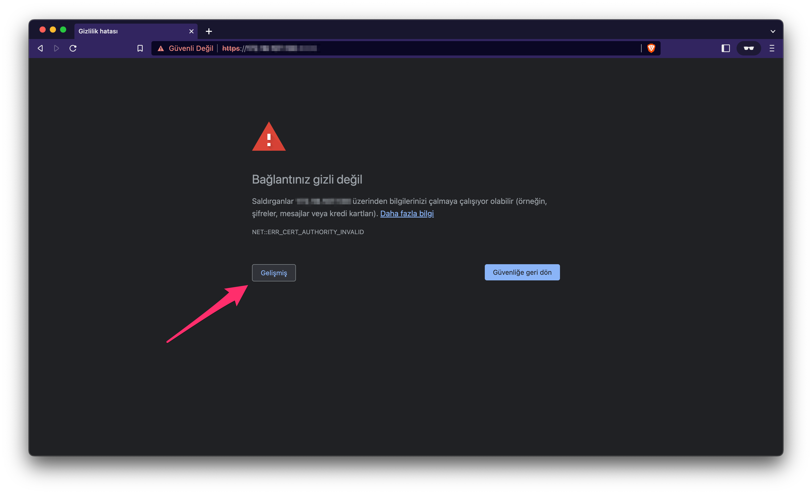
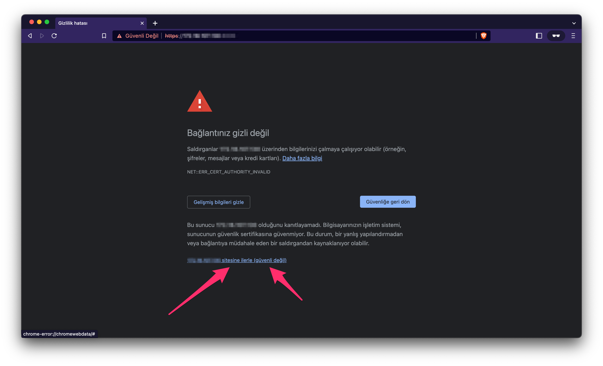
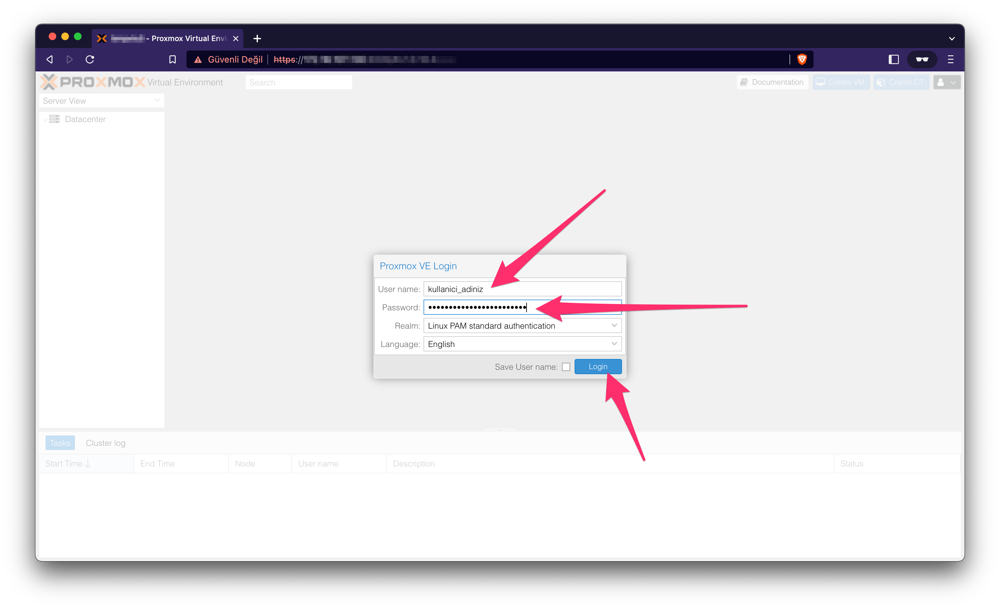

# Proxmox Sunucu Paneline Erişme

!!! note "Proxmox"
    Proxmox, sunucuların yönetim ve kullanımı için kullanılan bir yazılımdır.

### **Adım 1 - Panel Adresinini Gir**

Proxmox paneline erişim için tarayıcınızın arama çubuğuna `https://[SUNUCU_IP_ADRESI]:[SUNUCU_PORT_NUMARASI]` adresini yazın.

!!! example "Örnek"
    https://111.222.333.444:5555

!!! tip "Sunucu Bilgilerini Bilmiyor Musun?"
    `SUNUCU_IP_ADRESI` ve `SUNUCU_PORT_NUMARASI` bilgileri size kimlik bilgileri ile iletilmektedir. Eğer bilmiyorsanız [İletişim](iletisim.md)'den yardım isteyin.

### **Adım 2 - Güvensiz Sertifika Uyarısını Kabul Et**

Tarayıcınız, açılacak sayfanın güvensiz olduğu ile ilgili çıkardığı uyarıda riski kabul ederek ilerleyin.

### **Adım 3 - Proxmox Paneline Giriş Yap**

Proxmox kullanıcı bilgileriniz ile giriş yapın.

!!! tip "Kimlik Bilgilerini Bilmiyor Musun?"
    Eğer kimlik bilgilerinizi bilmiyorsanız [İletişim](iletisim.md)'den yardım isteyin.

