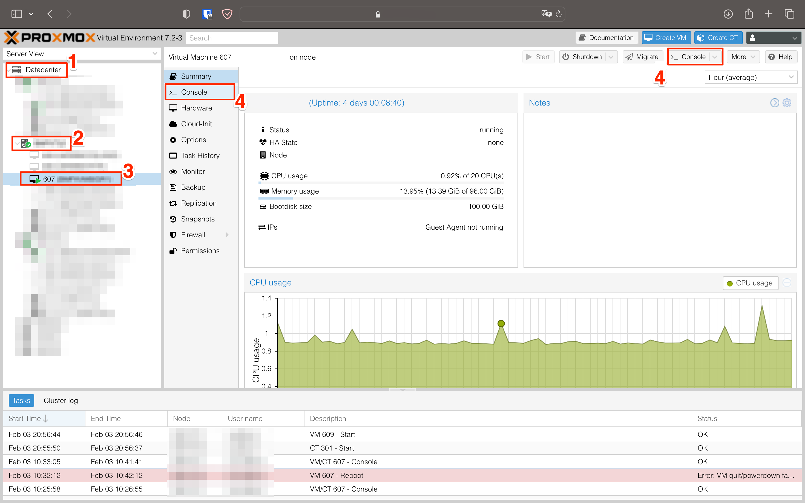
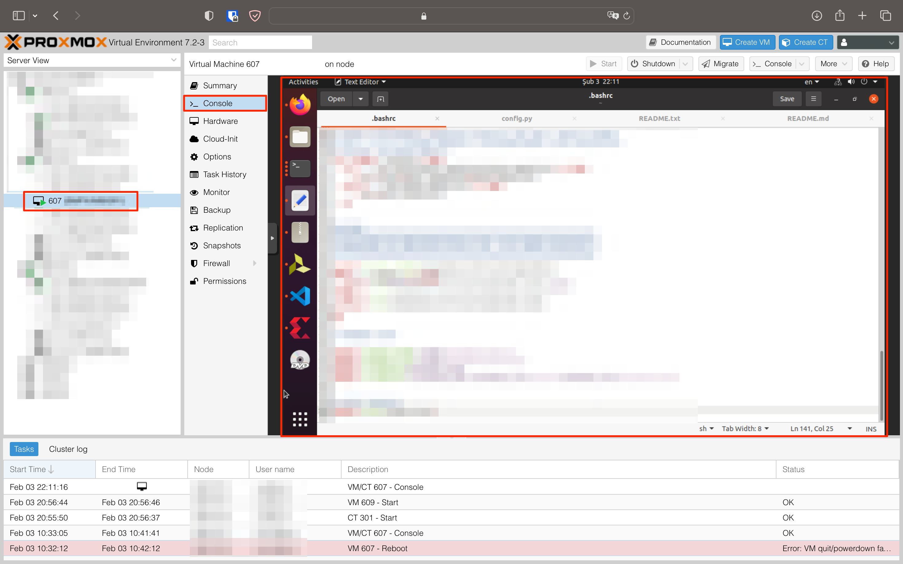

# Sunucuya (Sanal Makineye) Bağlanma

Proxmox kullanıcınıza tanımlı sanal makinenize bağlanmak için [hesabınıza giriş](02-sunucu-paneline-erisme.md) yaptıktan sonra aşağıdaki adımları izleyebilirsiniz.

1. Sol panelde `Datacenter` kategorisini seçin.

1. Datacenter içerisinde sanal makinenizin bulunduğu sunucuyu seçin.

1. Sunucu içerisinde sanal makinenizi seçin.

    !!! tip "Sanal Makine Bilgilerini Bilmiyor Musun?"
        Sunucu ve sanal makinenin no/isimleri size kimlik bilgileri ile iletilmektedir. Eğer bilmiyorsanız [İletişim](iletisim.md)'den yardım isteyin.

1. Sanal makinenin panelinden veya sağ üst köşeden `Console` butonuna basarak sunucunuza CLI/GUI ile bağlanabilirsiniz.

