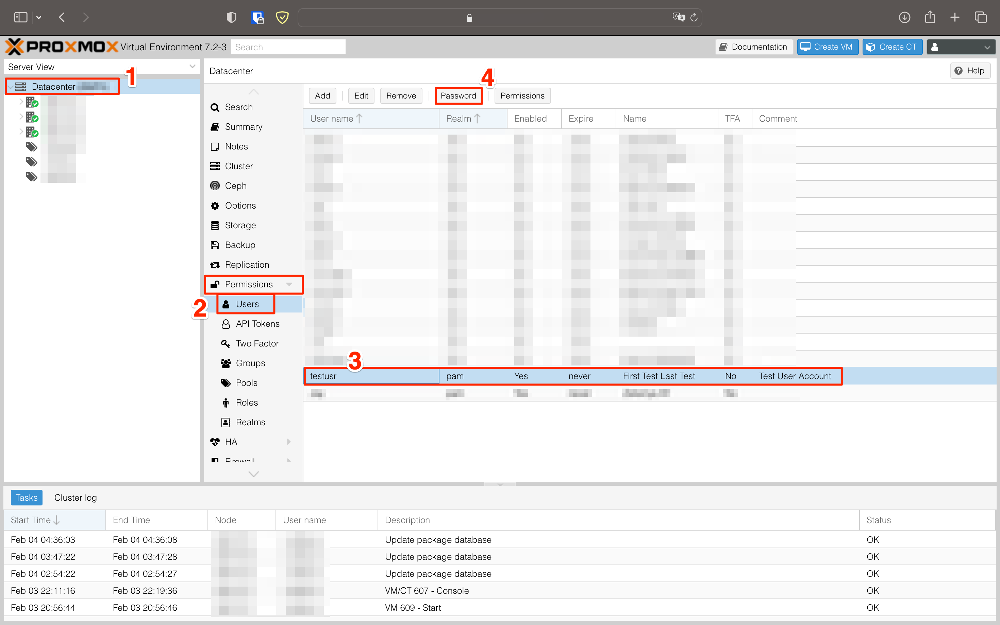
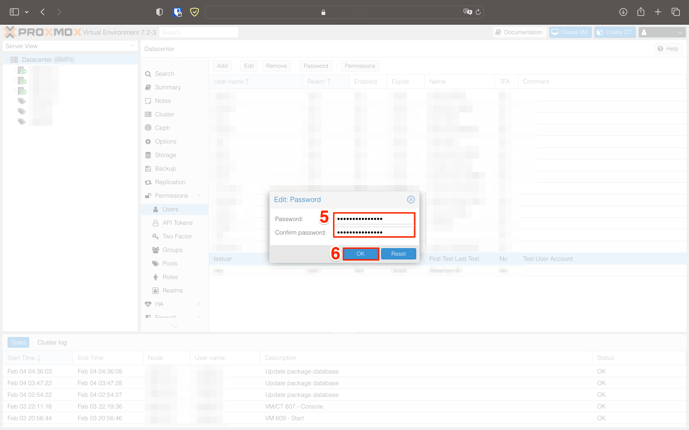

# Proxmox Hesabınızın Parolasını Değiştirme

Proxmox kullanıcınızın parolasını değiştirmek için [hesabınıza giriş](02-sunucu-paneline-erisme.md) yaptıktan sonra aşağıdaki adımları izleyebilirsiniz.

!!! tip "Parolanı Unuttun Mu?"
    Hesap parolanızı unuttuysanız [İletişim](iletisim.md)'den yardım isteyin.

1. Sol panelde `Datacenter` kategorisini seçin.

1. Datacenter panelinde `Users` kategorisini seçin.

1. Users panelinde kullanıcı adınızı seçin.

1. Users panelinin üstünde bulunan `Password` butonuna basın.

5. Yeni **güçlü** parolanızı girin.

6. `OK` butonu ile parolanızı değiştirin.

!!! failure "Hata Alıyor Musun?"
    Parola değişikliği sırasında veya sonrasında sorun yaşarsanız önce [Sorun Giderme](sorun-giderme.md) sayfasına bakın. Burada çare bulamazsanız [İletişim](iletisim.md)'den yardım isteyin.

 
