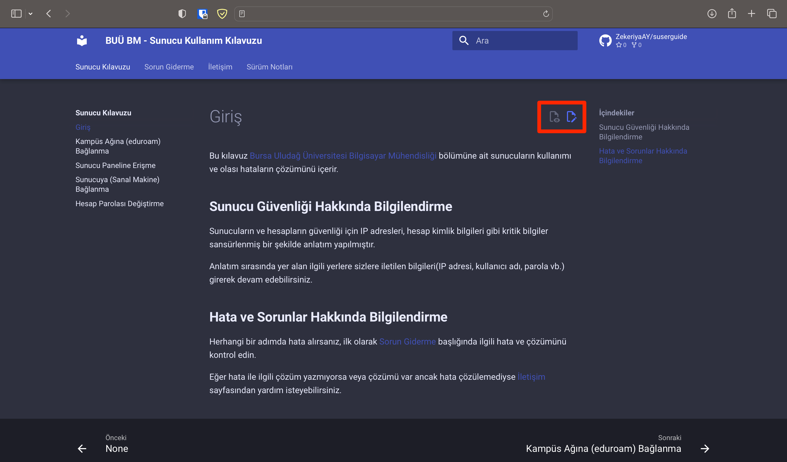

# Giriş

Bu kılavuz [Bursa Uludağ Üniversitesi Bilgisayar Mühendisliği](http://uludag.edu.tr/bm) bölümüne ait sunucuların kullanımı ve olası hataların çözümünü içerir.

## **Sunucu Güvenliği Hakkında Bilgilendirme**

Sunucuların ve hesapların güvenliği için IP adresleri, hesap kimlik bilgileri gibi kritik bilgiler sansürlenmiş bir şekilde anlatım yapılmıştır.

Anlatım sırasında yer alan ilgili yerlere sizlere iletilen bilgileri(IP adresi, kullanıcı adı, parola vb.) girerek devam edebilirsiniz.

## **Hata ve Sorunlar Hakkında Bilgilendirme**

Herhangi bir adımda hata alırsanız, ilk olarak [Sorun Giderme](sorun-giderme.md) başlığında ilgili hata ve çözümünü kontrol edin.

Eğer hata ile ilgili çözüm yazmıyorsa veya çözümü var ancak hata çözülemediyse [İletişim](iletisim.md) sayfasından yardım isteyebilirsiniz.

## **Kılavuzun Geliştirilmesi için Katkı Yapın**

Bu kılavuzun geliştirilmesi, [Sorun Giderme](sorun-giderme.md) sayfasının zenginleştirilmesi için karşılaştığınız sorun, çözüm veya yenilikleri her sayfanın sağ üst kısmında bulunan butonlar ile katkıda bulunabilirsiniz. 

