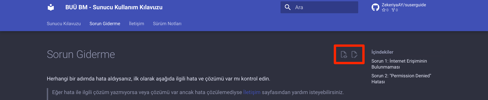

---
hide:
  - navigation
---

# Sorun Giderme

Herhangi bir adımda hata aldıysanız, ilk olarak aşağıda ilgili hata ve çözümü var mı kontrol edin.

!!! failure "Hata Çözümü Yok Mu?"
    Eğer hata ile ilgili çözüm yazmıyorsa veya çözümü var ancak hata çözülemediyse [İletişim](iletisim.md) sayfasından yardım isteyebilirsiniz.

!!! tip "Kılavuzu Güncellemeye Yardım Edin!"
    Sunucular/işletim sistemleri ile ilgili karşılaştığınız sorunları ve çözümlerini sağ üst köşedeki butonlar yardımıyla bu sayfaya ekleyerek katkıda bulabilirsiniz.
    

## **Sorun 1:** *İnternet Erişiminin Bulunmaması*

Çözüm 1 içeriği...

## **Sorun 2:** *"Permission Denied" Hatası*

Çözüm 2 içeriği...

 
