\pagebreak

# Giriş
Bu kılavuz BUÜ Bilgisayar Mühendisliği Bölümüne ait sunucuların kullanımı ve olası hataların çözümünü içerir.

Kılavuzun kapak sayfasında son güncellenme tarihi ve ***[`Sürüm Notları`](#sürüm-notları)*** bölümünde yer alan, kılavuzda yapılan değişikliklerle ilgili notlar ile güncelliğini kontrol edebilirsiniz.

Sunucuların ve hesapların güvenliği için kılavuzda IP adresleri, hesap kimlik bilgileri gibi kritik bilgiler olmadan, sansürlenmiş bir şekilde anlatım yapılmıştır. Anlatım sırasında yer alan ilgili yerlere sizlere iletilen bilgileri(IP adresi, kullanıcı adı, parola vb.) girerek devam edebilirsiniz.\

Herhangi bir adımda hata alırsanız, ilk olarak ***[`Sorun Giderme`](#sorun-giderme)*** başlığında ilgili hata ve çözümü var mı kontrol edin.
Eğer hata ile ilgili çözüm yazmıyorsa, çözümü var ancak hata çözülemediyse kapak sayfasında yer alan ***[`031990037@ogr.uludag.edu.tr`](mailto:031990037@ogr.uludag.edu.tr)*** mail adresi üzerinden veya sunucularla ilgilenen öğretim görevlileri, öğrenciler ile iletişim kurarak yardım isteyebilirsiniz.


\pagebreak


# 1. Üniversite Ağına Bağlanma
Üniversite internet ağına bağlı değilseniz ***[`vpn.uludag.edu.tr`](http://vpn.uludag.edu.tr/)*** sayfasındaki kurulum adımlarını takip ederek VPN bağlantınızı yapmanız gerekmektedir. 

Eğer üniversite ağına bağlı iseniz veya VPN bağlantınız sağlanmış ise sonraki adıma geçebilirsiniz.\

> ***Üniversite ağına bağlanma adımında bir sorun yaşadıysanız [`Sorun Giderme`](#sorun-giderme) başlığına göz atın.***


\pagebreak


# 2. Sunucuya Uzaktan Bağlantı
CLI(komut satırı, terminal) ve GUI(uzaktan masaüstü, arayüz) ile erişim için ayrı ayrı anlatımlar aşağıda bulunuyor. Her erişim yönteminin de Windows, macOS ve GNU/Linux için ayrı anlatımları bulunmaktadır. İhtiyacınız olan adımları takip edebilirsiniz.

## 2.1. CLI(Komut Satırı Arayüzü) ile Bağlantı
### 2.1.1. Windows

### 2.1.2. macOS

### 2.1.3. GNU/Linux
Herhangi ek programa ihtiyaç duymadan kullandığınız Linux dağıtımının terminalini açarak devam edebilirsiniz. Bazı dağıtımlarda `CTRL+ALT+T` klavye kombinasyonu ile terminali açabilirsiniz.

```sh
ssh KULLANICI-ADI@SUNUCU-IP-ADRESI
```
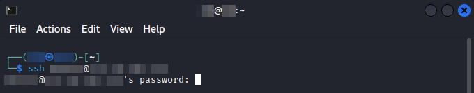
Eğer sertifika onayı gibi bir yazı çıkarsa **`yes`** yazarak devam edebilirsiniz.\
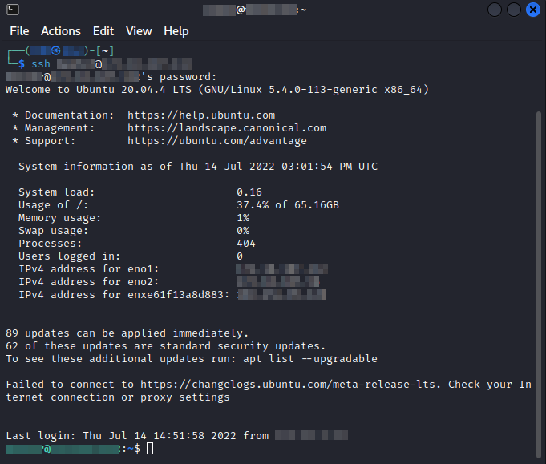\

> ***SSH ile bağlantı adımında bir sorun yaşadıysanız [`Sorun Giderme`](#sorun-giderme) başlığına göz atın.***


\pagebreak


## 2.2. GUI(Grafiksel Kullanıcı Arayüzü) ile Bağlantı
### 2.2.1. Windows

### 2.2.2. macOS

### 2.2.3. GNU/Linux
Birçok Linux dağıtımında Remmina programını kullanarak RDP bağlantısı yapılabiliyor. Bu yüzden anlatımda Remmina kullanılacaktır.

Remmina'nın resmi kurulum kılavuzu olan ***[`How to install Remmina?`](https://remmina.org/how-to-install-remmina/)*** yazısında kullandığınız Linux dağıtımına uygun adımları takip ederek kurabilirsiniz.

1. Uygulamayı açtıktan sonra sol üst köşede bulunan **`+`** simgesine tıklayarak yeni bağlantı profili oluşturun.\
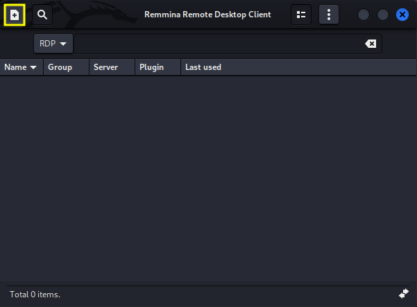

1. Profilleri kolay ayırt edebilmek için isim verebilirsiniz. Örnekte **`Test Server 2`** adı verilmektedir.
1. **`RDP`** protokolünü seçin.
1. **`Basic`** sekmesindeki **`Server`** alanına bağlantı kuracağınız sunucunun IP adresini girin.
1. Eğer ***[`Remmina Düşük Ekran Çözünürlüğü`](#remmina-düşük-ekran-çözünürlüğü)*** sorununu yaşarsanız **`Basic`** sekmesinin altında bulunan **`Resolution`** kısmını **`Use initial window size`** seçeneğinden **`Use client resolution`** seçeneğine değiştirerek çözebilirsiniz.
1. İlgili yerleri doldurduktan sonra **`Save`** butonuna basarak profili kaydedebilirsiniz.\
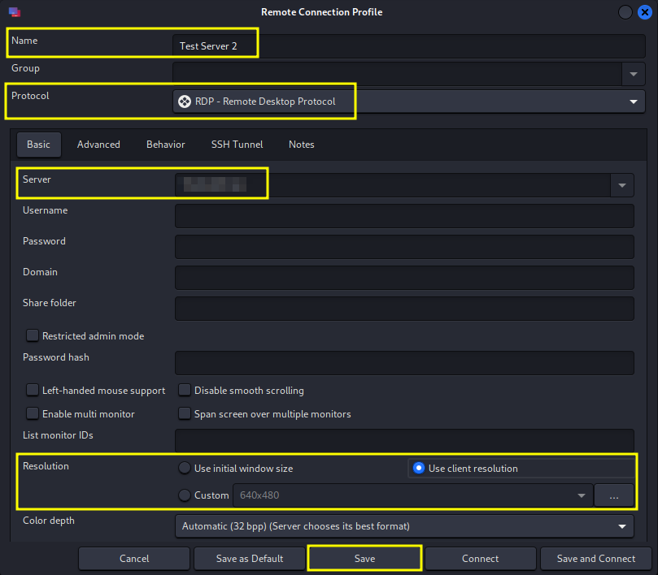

1. Oluşturulan profile çift tıklayarak bağlantıyı başlatın.\
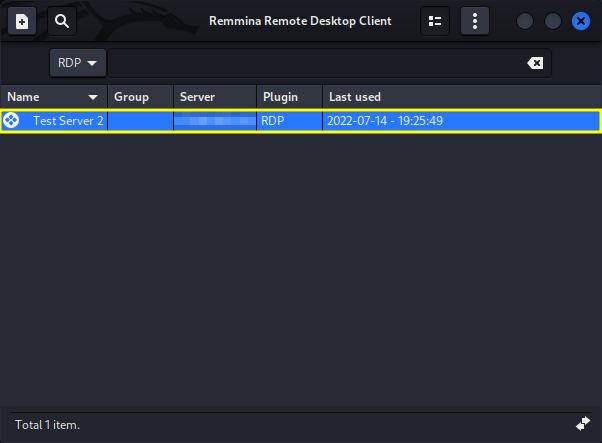

1. İlk bağlantıda sertifika onayı isteyecektir. Bu sertifikayı kabul ederek devam edin.\
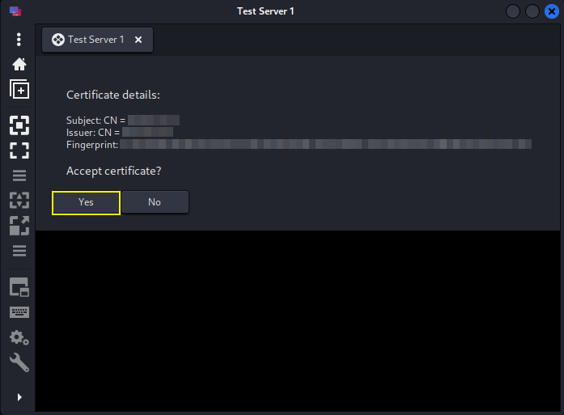

1. Xrdp giriş ekranına Linux kullanıcı adı ve parolanızı doldurun.
1. Doğru bilgileri girdikten sonra **`OK`** butonuna basarak giriş yapın.\
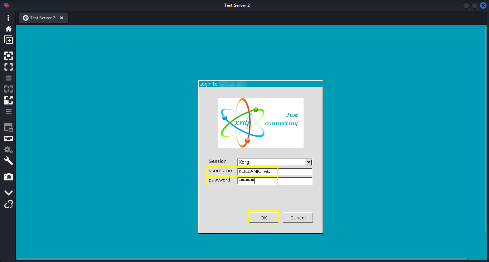

1. Remmina kullanarak GUI bağlantısı gerçekleştirildi.\
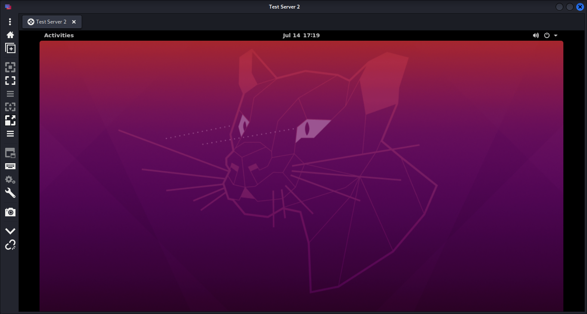\

> ***Remmina ile RDP bağlantısı adımında bir sorun yaşadıysanız [`Sorun Giderme`](#sorun-giderme) başlığına göz atın.***


### 2.2.4. RDP Oturumunu Kapatma
> Bu adım Windows, macOS ve Linux işletim sisteminde benzer şekilde gerçekleştiğinden her işletim sistemi için anlatılmamıştır.

Sunucu ile ilgili işiniz bittikten sonra RDP programını direkt kapatmamanız önerilir. Öncelikle Linux hesabınızdan çıkış yapın.\
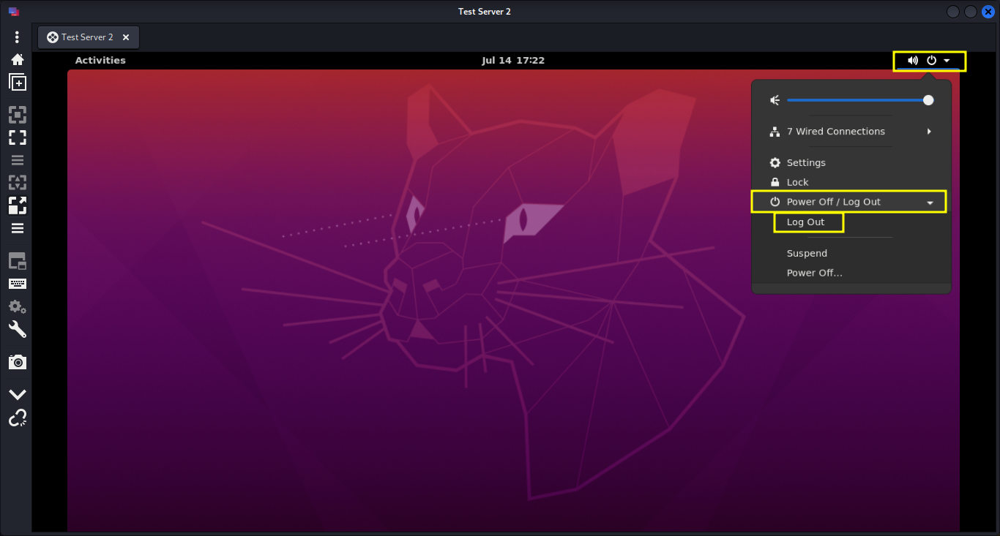
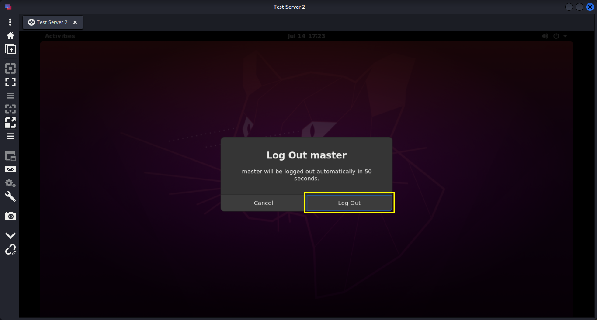

Hesabınızdan çıkış yaptıktan sonra RDP programını kapatabilirsiniz.\
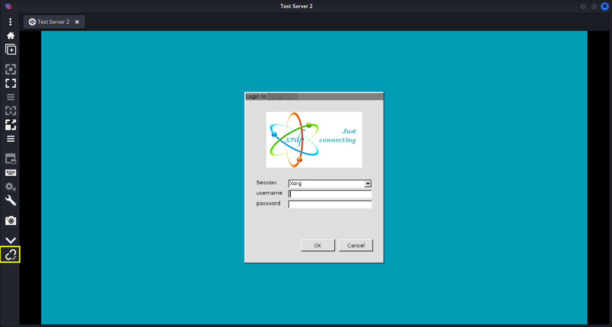\

> ***RDP oturumunu kapatma adımındada bir sorun yaşadıysanız [`Sorun Giderme`](#sorun-giderme) başlığına göz atın.***


\pagebreak


# 9. Sorun Giderme
> Herhangi bir adımda hata aldıysanız, ilk olarak aşağıda ilgili hata ve çözümü var mı kontrol edin.

Eğer hata ile ilgili çözüm yazmıyorsa, çözümü var ancak hata çözülemediyse kapak sayfasında yer alan ***[`031990037@ogr.uludag.edu.tr`](mailto:031990037@ogr.uludag.edu.tr)*** mail adresi üzerinden veya sunucularla ilgilenen öğretim görevlileri, öğrenciler ile iletişim kurarak yardım isteyebilirsiniz.


## 9.1. Remmina Düşük Ekran Çözünürlüğü
Remmina ile bağlandığınızda ekran çözünürlüğünün örnekteki gibi çok düşük olma sorunu var ise;\
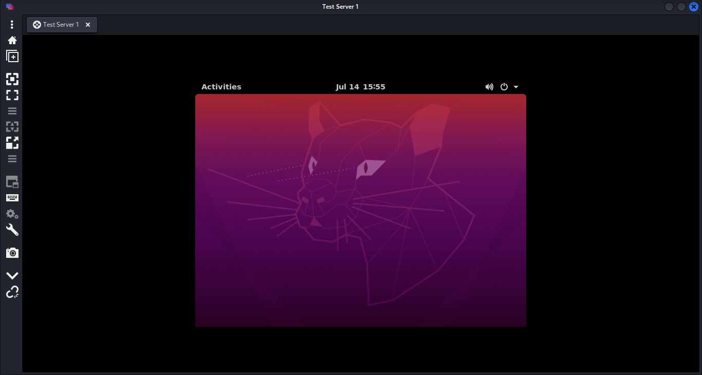

1. Remmina bağlantı profilinize sağ tıklayarak **`Edit`** butonu ile düzenleyin.
1. **`Basic`** sekmesinin altında bulundan **`Resolution`** kısmını **`Use initial window size`** seçeneğinden **`Use client resolution`** seçeneğine değiştirerek çözebilirsiniz.
1. Değişiklikleri yaptıktan sonra **`Save`** butonuna basarak profili kaydetmeyi unutmayın.\
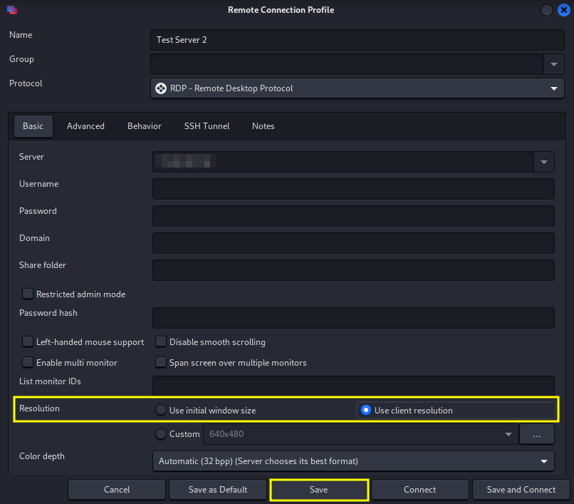


## 9.2. RDP Login Sonrası Siyah Ekran
Bu sorunun oluşmasının nedeni Linux kullanıcı hesabının halen açık olmasından kaynaklanıyor. Önceki RDP oturumlarınızı Linux hesabınızdan logout olmadan sonlandırmanız siyah ekran problemine sebep olabilir. 

Eğer açık RDP oturumlarınızı kapatabilme şansınız var ise kapatıp tekrar login olmayı deneyebilirsiniz. Eğer açık oturumları kapatamıyorsanız ***[`031990037@ogr.uludag.edu.tr`](mailto:031990037@ogr.uludag.edu.tr)*** mail adresi üzerinden veya sunucularla ilgilenen öğretim görevlileri, öğrenciler ile iletişim kurarak kapatmalarını talep edebilirsiniz.


\pagebreak


# Sürüm Notları

